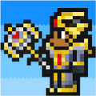

# Example Mod
Every LuArian has a journey

  
_Update `ModIcon.png` to change your mods default icon._

## Getting Started
If you are new to LuAria mod development, we highly recommand you head over to our docs page and read the [Getting Started](https://docs.luaria.app/category/getting-started) guide.

## Build Instructions
First lets start of by tapping on the 3 dots (⁝) icon in the top right corner of your mod folder, you will see multiple options:

Select `Run`, this will build & run your mod.

For more info, see [our docs](https://docs.luaria.app/getting-started/create-build-new-mod)

## Helpful References
- [LuAria Documentation](https://docs.luaria.app)